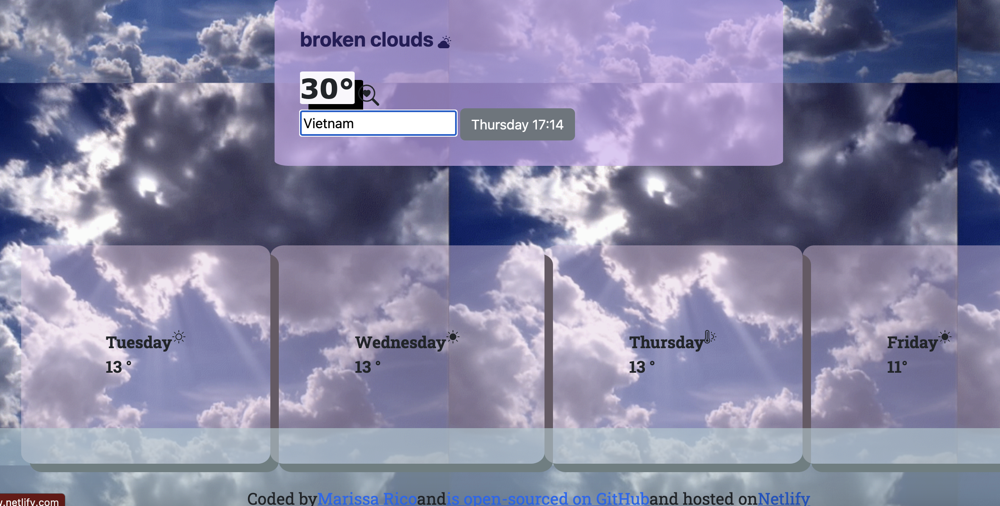

## SheCodes.io👩🏽‍💻

# Vanilla Search Engine Project

<em> Welcome to my Vanilla Weather App Project </em>

### General Data

**- Project Designer:**

Marissa Rico

**- Project Tittle:**

Vanilla Weather App project

  
Table of Contents 

  <ol>
  <li><a href="#objetive-🎯">Objetive</a></li>
  <li><a href="#About the Project-🔎">About the Project</a></li>
  <li><a href="#Deploy-🚀">Deploy</a></li>
  <li><a href="#Views">Views</a></li>
  <li><a href="#Licence">Licence</a></li>
  <li><a href="#Contact">Contact</a></li>
  </ol>

## Objective🎯

This weather application will provide you with real-time weather information, forecasts, date and time in other cities which can help you make better decisions about your day-to-day activities.

## About the project-🔎

I mainly worked with tools such as Bootstrap, html5, CSS3, ES6, and flex to create this Responsive and Minimalistic Weather App.

I have also included some javascript basic functions to create the Search Engine that will give you the accurate weather Data of the city you search for.

The project is hosted on Netlify.

## Deploy 🚀 🚀

<a href="https://vanillaweather-appshecodes.netlify.app/"> production URL </a>

## Views

You will be able to search for any city and get the accurate date, time and weather.

☔️ 🌧️ 🌈 have fun!!!

## Licence

This project is under licence of "My Name"

## Contact 👩🏽‍💻

